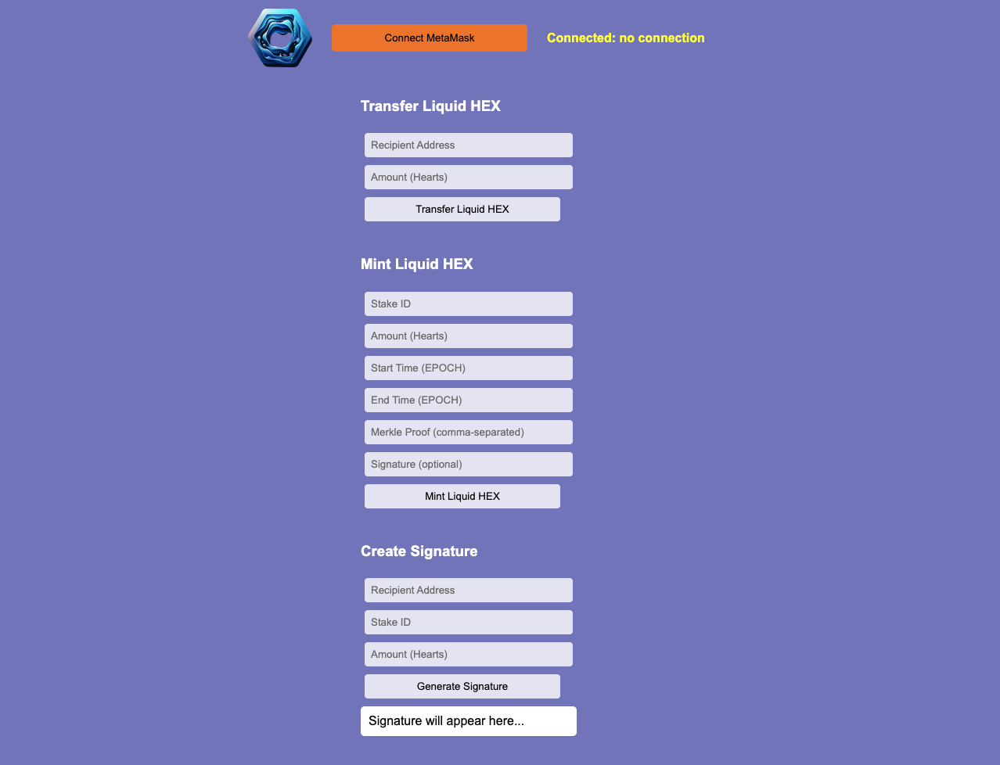

# Run Liquid HEX downloadable DEFI Frontend

Download this repository to your local PC. It consists of pure HTML, CSS, and JavaScript code. You can replace the `ethers.umd.min.js` and `web3.min.js` files with your versions or use the ones provided in the repository for convenience. Please find further instructions below, depending on your OS.

- [Running on Mac](#running-on-mac)
- [Running on Windows](#running-on-windows)
- [Running on Ubuntu](#running-on-ubuntu)
- [Instructions for Minting Liquid HEX](#instructions-forminting-liquid-hex)

## Running on Mac

To run the self-hosted Web3 Liquid HEX Frontend on your Mac, you'll need to set up a local server environment and serve the files you downloaded from this repository. Here's a simple way to do it using Python, which is likely already installed on your Mac. Alternatively, you can use Node.js or another local server solution that you are comfortable with.

### Step 1: Save the Files

Ensure all these files are saved in the same directory.

### Step 2: Set Up a Local Server

Python provides a simple HTTP server module that you can use to serve files from your filesystem. The command you'll use depends on the version of Python installed on your system.

#### For Python 3.x

1. Open the Terminal app.
2. Use the `cd` command to navigate to the directory where you saved your files. For example, if your files are in a directory named `liquidhex_frontend` on your Desktop, you would enter: `cd ~/Desktop/liquidhex_frontend`.
3. Run the following command to start a local server: `python3 -m http.server`. By default, this command serves files on port 8000. You can specify another port by adding a port number at the end, like `python3 -m http.server 8080`.

#### For Python 2.x

If for some reason you're using Python 2.x (though it's recommended to use Python 3 as Python 2 is no longer supported), the command is slightly different: `python -m SimpleHTTPServer`.

### Step 3: Access Your Locally Hosted Site

1. Open a web browser and go to `http://localhost:8000` (or whichever port you chose).
2. You should see your site, with a "Connect MetaMask" button. Make sure you have MetaMask installed in your browser and are logged in.

### Note on MetaMask and Networks

- Ensure MetaMask is installed in your browser. The local server serves your files to the browser, but interactions with the Ethereum network will be handled by MetaMask.
- Ensure MetaMask is connected to the correct network that matches the Liquid HEX token's deployment.

### Advanced: Using Node.js

If you're familiar with Node.js, you can use the `http-server` package for a similar setup. Install it globally via npm: `npm install -g http-server`. Then, navigate to your project directory in Terminal and run: `http-server`. This will also serve your files on a local web server, typically available at `http://localhost:8080`.

### Troubleshooting

- **MetaMask Connection Issues:** Ensure your browser has MetaMask installed and that it is set to the correct network.
- **File Not Found:** Verify that all files are named correctly and located in the same directory.
- **Python Not Found:** Ensure Python is installed on your MacBook. If not, download it from the official Python website or use Homebrew by running `brew install python`.

## Running on Windows

To run the self-hosted Web3 Liquid HEX Frontend on a Windows machine, you'll also need to set up a local server environment to serve the HTML, CSS, and JavaScript files in this repository. Here's a step-by-step guide using Python, which is a straightforward method. If Python isn't installed, you can use an alternative using Node.js.

### Step 1: Install Python (if not installed)

If Python isn't already installed:

1. **Download Python:**
   - Visit the [official Python website](https://www.python.org/downloads/windows/).
   - Download the latest Python installer for Windows.
2. **Install Python:**
   - Run the installer.
   - Make sure to check the box that says "Add Python to PATH" before clicking "Install Now".

### Step 2: Save Your Files

Ensure all these files are in the same directory.

### Step 3: Set Up a Local Server Using Python

1. **Open Command Prompt:**
   - Search for "cmd" in the Start menu and open Command Prompt.
2. **Navigate to Your Project Directory:**
   - Use the `cd` command to change directories to where your files are saved. For example: `cd path\to\your\directory`. Replace `path\to\your\directory` with the actual path to your directory.

3. **Start the Server:**
   - If you have Python 3 installed, run: `python -m http.server`. This command serves files on port 8000 by default. You can specify another port by adding it at the end, like `python -m http.server 8080`.
   - If you're using Python 2 (which is less likely and not recommended as it's no longer supported), use: `python -m SimpleHTTPServer`.

### Step 4: Access Your Site

- **Open a Web Browser:**
  - Navigate to `http://localhost:8000` or whatever port you specified.
- **Interact with Your Frontend:**
  - Ensure MetaMask is installed in your browser and that you're logged in and connected to the correct network.

### Alternative Using Node.js

If you prefer using Node.js or encounter issues with Python:

1. **Install Node.js:**
   - Download Node.js from the [official site](https://nodejs.org/en/download/).
   - Run the installer and follow the prompts.

2. **Install `http-server`:**
   - Open Command Prompt and install `http-server` globally using npm: `npm install -g http-server`.

3. **Serve Your Files:**
   - Navigate to your project directory in Command Prompt as before.
   - Run the following command: `http-server`. This typically serves files on `http://localhost:8080`.

### Troubleshooting

- **Browser Compatibility:** Ensure your browser supports the Web3 interface, particularly MetaMask.
- **Network Connections:** Make sure MetaMask is connected to the correct blockchain network.
- **Permission Issues:** Running servers might require administrative privileges on some systems.

## Running on Ubuntu

Running your Web3 frontend on Ubuntu (including both Ubuntu Server and Ubuntu Desktop) involves setting up a simple local web server. You can use Python for this, as it's often pre-installed on Ubuntu systems. Alternatively, you can use Node.js if you prefer. Below is a guide for both methods.

### Using Python to Set Up a Local Server

#### Step 1: Check for Python Installation

First, ensure Python is installed. Most Ubuntu systems come with Python 3 pre-installed.

1. Open your Terminal.
2. Check Python version: `python3 --version`. This should return a version number. If not, install Python using: `sudo apt update` and `sudo apt install python3`.

#### Step 2: Save Your Files

Ensure all these files are in the same directory.

#### Step 3: Start the Server

Navigate to the directory containing your files and start the server:

1. Open Terminal and `cd` into your project directory: `cd /path/to/your/project`.
2. Run the server: `python3 -m http.server`. This will host your files on the default port 8000. You can specify another port by appending it to the command, like `8001`: `python3 -m http.server 8001`.

#### Step 4: Access Your Site

- Open a web browser and go to `http://localhost:8000` (or whichever port you chose).

### Using Node.js to Set Up a Local Server

#### Step 1: Install Node.js

If Node.js isn't installed, you can install it via Ubuntu's package manager:

1. Open Terminal.
2. Update your package list: `sudo apt update`.
3. Install Node.js: `sudo apt install nodejs npm`.
4. Verify the installation: `nodejs --version`.

#### Step 2: Install `http-server`

With Node.js installed, you can use `http-server`, a simple, zero-configuration command-line HTTP server:

1. Install `http-server` globally: `sudo npm install -g http-server`.

#### Step 3: Serve Your Files

1. Navigate to your project directory in Terminal.
2. Start the server: `http-server`. By default, `http-server` listens on port 8080.

#### Step 4: Access Your Site

- Open your browser and navigate to `http://localhost:8080`.

### General Troubleshooting

- **MetaMask Issues:** Ensure MetaMask is correctly installed in your browser and connected to the appropriate network.
- **Permissions:** You might need elevated permissions (`sudo`) to install software or use certain ports on Linux.
- **Firewall:** Ensure that your firewall settings are not blocking the ports used by your server.

## Instructions for Minting Liquid HEX

Once you are running the Frontend [http://localhost:8080](http://localhost:8080) or on your preferred local port, you will see the UI as depicted below:

You can do 3 things:
1. Transfer Liquid HEX tokens
2. Mint Liquid HEX tokens
3. Create a signature for minting Liquid HEX tokens to a different address

First, you have to connect to MetaMask.

### Writing Amounts in Hearts

In this frontend, you will have to always write the amount of Liquid HEX token in Hearts. This means you have to add 8 zeros to the Liquid HEX amount you want to mint:
- 1 Liquid HEX = 100,000,000 Liquid Hearts

### Claiming Liquid HEX

When you claim your Liquid HEX, you have to write the timestamp in EPOCH time format into the frontend. When writing the Merkle Proof for the claim, you have to write the hashes separated by a comma.

### Necessary Files

You can find most of the information in a readable format in the `eligible_stakes.csv` file. The Merkle Proofs have to be taken out of the `merkle_tree_proofs.json` file, which can be downloaded with the Frontend here on GitHub in a zip file. The file is too big to be uploaded in its raw format.

To get the exact formats for the frontend inputs, you can also open the `merkle_tree_base.csv` file to get the Start Time and End Time in its EPOCH format and the Amount in Hearts directly. Merkle Proofs still have to be taken out of the `merkle_tree_proofs.json` file.

### Example for Stake ID=3

- **Stake ID:** 3
- **Amount (Hearts):** 729900000000
- **Start Time (EPOCH):** 1859760000
- **End Time (EPOCH):** 1922054399
- **Merkle Proof (comma-separated):** 0x88bd527b96544e6290984e63b7bfa33685488038da3441be8e99286273bedcab,0x3e3d7b0491ca2e8c9cdc0e13db3563fbe8a2397df0c304e3402efafdcdb9788b,0xace069ca428e8454b4053db28fe4a17a6a78d1bcba30baabe51dac97f21d212a,0x3e72ab0ab2ffb6d469c9af2a09b42b2ce6aee99efad34a2219329f52acf00468,0x0a0eb7f112861f6115a326b9e71924caa5699ab6dee94b929c88097d594fc0fa,0x98b1efd762d06eebc07acb265f32ddbdf4133531d356630a436f58162bbf83e4,0x2270a0e2fb1c17aa52afcc6db0a3eabea52282a1d9049ee7ce981e0f44ab0f8b,0xa7a7c3d30f7c5a78f725b702be6b783a2df13950e6a806c4a1f9d3a53e04d04e,0x65f068552c5c81df97c9454cde6f5c5ede9e59f6ad37b3f52cde691d652ef8fa,0x942a6da0eba5c647f002a6712bdc08d1ab7e80ae4be80500359fb270437c06e8,0xec29bc3a3194fa6fecde9c587c4c950f634ce38e1813458b022c0dce0655885b,0x87e81f401dd465afc1a7ddeb0f80b2bca6d148ede820861ddbd1fa6d1ca7b34f,0x80019772faad331eeaed2605582e0623b12eaa59de7f630f357625dd68c1bdd0,0x46a4ab88cb286defa5599c9ce0c16edd88ef29919fab861cf85a68c0e824f8a9,0x10342b150a10853a2dceabb1ef91ba071f133645f2bf46912312a842609fddf4,0x388812c5f17cf78ed44a1d30bdc18c3234ba243d66220ff4af1d3162c360203c,0x89b5262daf9d0880de3760b54e7f9532b0c056dc6c1f9e14983b4a719ac02270,0xe0b8c309a5432336ca8c1fda5ebdf60606e3235d9506923ba01bbf06daf85ca8

